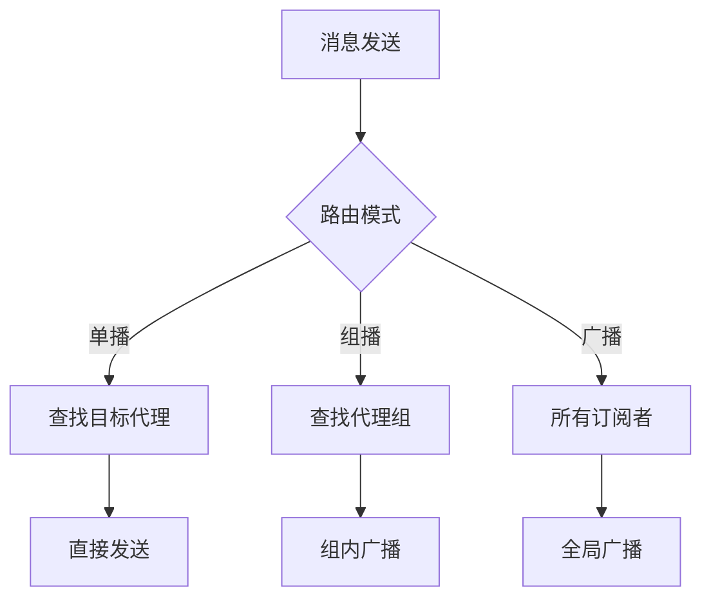

# Asgard.Hoenir - A2A消息总线系统

Asgard.Hoenir是一个轻量级、高性能的事件驱动消息总线系统，支持进程内通信和A2A（Agent-to-Agent）通信。基于现有事件总线架构，通过最小化修改实现A2A通信能力。

## 🚀 核心特性

### 多模式消息路由
- **单播 (Unicast)**: 精确发送到指定代理
- **组播 (Group)**: 发送到同类代理组
- **广播 (Broadcast)**: 发送到所有订阅者

### 智能寻址
- 基于`To`属性的统一寻址方案
- 动态代理注册与发现
- 零学习成本的迁移路径

### 向后兼容
- 现有代码100%兼容
- 零破坏性升级
- 渐进式功能增强

## 📁 项目结构

```
Asgard.Hoenir/
├── MessageDataItem.cs          # 消息数据模型
├── MessageHubManager.cs       # 消息中心管理器
└── README.md                  # 本文档
```

## 🔧 快速开始

### 1. 注册为网络代理

```csharp
using Asgard.Hoenir;

// 注册为代理节点
MessageHubManager.Instance.RegistCB("user-request", HandleUserRequest, "user-service-1");
MessageHubManager.Instance.RegistCB("order-request", HandleOrderRequest, "order-service-1");
```

### 2. 发送A2A消息

#### 单播到指定代理
```csharp
var message = new MessageDataItem
{
    Source = "api-gateway-1",
    To = "user-service-1",
    Data = new { action = "getUser", userId = 123 }
};

var response = MessageHubManager.Instance.Trigger("user-request", message);
```

#### 组播到代理组
```csharp
var groupMessage = new MessageDataItem
{
    Source = "system-monitor",
    To = "user-service-*", // 组名
    Data = new { action = "cache-invalidate", keys = new[] { "user:123" } }
};

MessageHubManager.Instance.Trigger("system-event", groupMessage);
```

#### 广播到所有节点
```csharp
// 传统方式（完全兼容）
MessageHubManager.Instance.Trigger("system-shutdown", new MessageDataItem { Data = "系统维护中" });

// A2A方式
var broadcast = new MessageDataItem
{
    Source = "system-monitor",
    To = "*", // 广播到所有节点
    Data = new { action = "system-update", version = "2.0.0" }
};
MessageHubManager.Instance.Trigger("broadcast-event", broadcast);
```

### 3. 接收A2A消息

```csharp
// 注册单播处理器
MessageHubManager.Instance.RegistCB("user-request", HandleUserRequest, "user-service-1");

// 注册组播处理器
MessageHubManager.Instance.RegistCB("user-service-*", HandleGroupMessage, "user-service-1");

// 注册广播处理器
MessageHubManager.Instance.RegistCB("*", HandleBroadcast, "system-monitor");

MessageDataItem? HandleUserRequest(MessageDataItem? message)
{
    var userId = message?.GetData<dynamic>()?.userId;
    Console.WriteLine($"处理用户请求: {userId}");
    return new MessageDataItem { Data = new { success = true, user = new { id = userId, name = "张三" } } };
}

MessageDataItem? HandleGroupMessage(MessageDataItem? message)
{
    var keys = message?.GetData<dynamic>()?.keys;
    Console.WriteLine($"处理组播消息: {string.Join(", ", keys)}");
    return new MessageDataItem { Data = new { success = true, keysProcessed = keys } };
}

MessageDataItem? HandleBroadcast(MessageDataItem? message)
{
    var action = message?.GetData<dynamic>()?.action;
    Console.WriteLine($"处理广播消息: {action}");
    return new MessageDataItem { Data = new { success = true, actionReceived = action } };
}
```

## 🏗️ 架构设计

### 统一寻址方案

| 模式 | 地址格式 | 示例 |
|---|---|---|
| 单播 | `具体代理ID` | `user-service-1` |
| 组播 | `代理组通配符` | `user-service-*` |
| 广播 | `*` | `*` |

### 消息生命周期



## 📊 性能特性

- **零拷贝消息传递**: 基于引用传递，避免序列化开销
- **智能去重**: 基于GUID的消息去重，防止重复处理
- **异步支持**: 非阻塞的异步消息处理
- **内存优化**: 可配置的缓存大小和清理策略

## 🔍 高级功能

### 消息追踪
```csharp
// 启用详细日志
MessageHubManager.LogDetailInfo = true;

// 消息包含调试信息
var message = new MessageDataItem
{
    Source = "OrderService.cs",
    Line = 42,
    Data = orderData
};
```

## 🎯 最佳实践

### 1. 代理命名规范
```csharp
// 推荐格式: {服务类型}-{实例编号}
MessageHubManager.Instance.RegistCB("user-service-prod-1", HandleUserRequest, "user-service-1");
MessageHubManager.Instance.RegistCB("order-service-prod-2", HandleOrderRequest, "order-service-2");
```

### 2. 消息版本控制
```csharp
// 在Header中添加版本信息
message.Header["version"] = "v1.0";
message.Header["schema"] = "user-v1";
```

### 3. 超时处理
```csharp
// 异步调用超时控制
var cts = new CancellationTokenSource(TimeSpan.FromSeconds(5));
var task = MessageHubManager.Instance.TriggerAsync("user-request", message);
var result = await task.WaitAsync(cts.Token);
```

### 4. 负载均衡
```csharp
// 组播实现负载均衡
MessageHubManager.Instance.Trigger("user-service-*", requestData);
```

## 🔄 迁移指南

### 从传统事件总线迁移

| 传统方式 | A2A方式 | 说明 |
|---|---|---|
| `RegistCB("event", handler, "id")` | 保持不变 | 100%兼容 |
| `Trigger("event", data)` | 保持不变 | 100%兼容 |
| 新增代理注册 | `RegistCB("event", handler, "id")` | 保持不变 |
| 新增单播 | 设置`Source`和`To`属性 | 新增功能 |
| 新增组播 | 设置`Source`和`To`属性为通配符 | 新增功能 |
| 新增广播 | 设置`To`属性为`*` | 新增功能 |

## 🧪 测试用例

### 单元测试示例
```csharp
[Test]
public void Test_A2A_Unicast()
{
    // Arrange
    var hub = MessageHubManager.Instance;
    var received = false;
    
    hub.RegistCB("test-request", HandleTestRequest, "test-service-1");
    
    // Act
    var message = new MessageDataItem
    {
        Source = "test-source",
        To = "test-service-1",
        Data = "test data"
    };
    hub.Trigger("test-request", message);
    
    // Assert
    Assert.IsTrue(received);
}

MessageDataItem? HandleTestRequest(MessageDataItem? message)
{
    received = true;
    return message;
}
```

## 📈 应用场景

### 微服务通信
- 服务间RPC调用
- 事件驱动架构
- 状态同步机制

### 插件系统
- 插件间通信
- 主程序与插件交互
- 插件生命周期管理

### 分布式系统
- 节点状态广播
- 配置变更通知
- 故障转移通知

## 📞 支持与反馈

如有问题或建议，请通过以下方式联系：
- 提交Issue到项目仓库
- 发送邮件到维护团队
- 参与社区讨论

---


