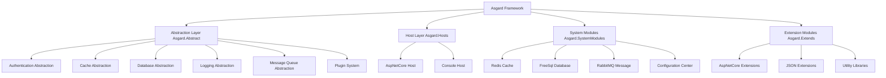

# Asgard Framework 🌳

[](https://dotnet.microsoft.com/)
[](https://docs.microsoft.com/en-us/dotnet/csharp/)
[](LICENSE)
[](https://github.com/your-org/asgard)

> **Asgard Framework** - A modern .NET microservices framework inspired by the Norse mythology Yggdrasil

## 🎯 Project Overview

Asgard is a highly modular .NET microservices framework inspired by Yggdrasil, the World Tree from Norse mythology. It provides complete microservices infrastructure including authentication, caching, database, logging, message queue and other core components, supporting plugin-based architecture and dynamic extension.

## ✨ Core Features

- 🧩 **Plugin Architecture** - Support dynamic loading and unloading of plugins
- 🏗️ **Modular Design** - Independent modules for authentication, caching, database, logging, message queue
- ⚙️ **Configuration Center** - Unified configuration management and dynamic updates
- 🔐 **JWT Authentication** - Complete identity authentication and authorization system
- 🗄️ **Multi-Database Support** - ORM based on FreeSql, supports multiple databases
- 📨 **Message Queue** - Integrated RabbitMQ, supports distributed message processing
- 🔄 **Caching System** - Redis cache support, improves system performance
- 🆔 **Distributed ID** - Snowflake algorithm for distributed unique ID generation
- 📊 **Task Scheduling** - Built-in scheduled tasks and background job support
- 🚀 **ASP.NET Core Integration** - Perfect support for ASP.NET Core hosting

## 🏗️ System Architecture

### Architecture Layers



### Core Concepts

- **Yggdrasil (World Tree)** - Framework core container, manages all components
- **Bifrost (Rainbow Bridge)** - Entry point of the plugin system
- **AsgardContext** - Context object, provides runtime environment
- **NodeConfig** - Node configuration, defines system behavior

## 🚀 Quick Start

### 1. Install Framework

```bash
# Create new project
dotnet new web -n MyAsgardApp
cd MyAsgardApp

# Add core packages
dotnet add package Asgard.Abstract
dotnet add package Asgard.Hosts.AspNetCore
```

### 2. Basic Configuration

Create configuration file `appsettings.json`:

```json
{
  "NodeConfig": {
    "Name": "MyAsgardApp",
    "DefaultDB": {
      "DbType": 3,
      "DbAddress": "Data Source=myapp.db"
    },
    "Redis": {
      "ConnectionString": "localhost:6379"
    },
    "AuthConfig": {
      "JwtKey": "your-secret-key",
      "Issuer": "MyApp",
      "Audience": "MyAppUsers"
    }
  }
}
```

### 3. Start Application

```csharp
using Asgard.Abstract.Models.AsgardConfig;
using Asgard.Hosts.AspNetCore;

var builder = WebApplication.CreateBuilder(args);

// Configure Asgard
var nodeConfig = new NodeConfig
{
    Name = "MyAsgardApp",
    DefaultDB = new DefaultDBConfig
    {
        DbType = (int)FreeSql.DataType.Sqlite,
        DbAddress = "Data Source=myapp.db"
    },
    WebAPIConfig = new WebApiConfig
    {
        HttpPort = 5000,
        HttpsPort = 5001
    }
};

// Build and start
var yggdrasil = new YggdrasilBuilder(nodeConfig)
    .UseFreeSqlDBManager()
    .UseRedisCache()
    .UseAuthModule()
    .BuildAspNetCoreHost();

await yggdrasil.LoadPluginFromAllSource().StartAsync();
```

## 📋 Detailed Documentation

### Configuration Management

Asgard uses unified `NodeConfig` configuration model:

```csharp
public class NodeConfig
{
    public string Name { get; set; }                    // Node name
    public DefaultDBConfig DefaultDB { get; set; }        // Database configuration
    public RedisConfig Redis { get; set; }              // Redis configuration
    public AuthConfig AuthConfig { get; set; }          // Authentication configuration
    public WebApiConfig WebAPIConfig { get; set; }      // WebAPI configuration
    public List<PluginItem> Plugins { get; set; }       // Plugin configuration
}
```

### Plugin Development

#### Create Plugin Project

1. Create class library project
2. Add reference to `Asgard.Abstract`
3. Choose appropriate base class based on host type

##### Basic Plugin (for all hosts)

```csharp
using Asgard.Abstract;
using Asgard.Abstract.DataBase;
using Asgard.Abstract.Logger;
using Asgard.Abstract.Plugin;

namespace MyPlugin
{
    public class MyBifrost : AbsBifrost
    {
        public MyBifrost(AbsDataBaseManager dbInstance, AbsLoggerProvider loggerProvider)
            : base(dbInstance, loggerProvider)
        {
        }

        /// <summary>
        /// Called after system startup is complete
        /// </summary>
        public override void OnSystemStarted(AsgardContext context)
        {
            LoggerProvider?.CreateLogger<MyBifrost>()
                .LogInformation("Plugin startup complete, EventID: {EventID}", context.EventID);
            
            // Execute plugin initialization logic here
        }

        /// <summary>
        /// Called when system is shutting down
        /// </summary>
        public override void SystemTryShutDown()
        {
            LoggerProvider?.CreateLogger<MyBifrost>()
                .LogInformation("Plugin is shutting down...");
            
            // Execute cleanup work here
        }

        /// <summary>
        /// Plugin ordering (optional)
        /// </summary>
        public override int Order => 1; // Default is 0
    }
}
```

##### ASP.NET Core Plugin

```csharp
using Asgard.Abstract;
using Asgard.Abstract.DataBase;
using Asgard.Abstract.Logger;
using Asgard.Hosts.AspNetCore;
using Microsoft.AspNetCore.Builder;
using Microsoft.Extensions.DependencyInjection;

namespace MyAspNetPlugin
{
    public class MyAspBifrost : AbsAspNetCoreHostBifrost
    {
        public MyAspBifrost(AbsDataBaseManager dbInstance, AbsLoggerProvider loggerProvider)
            : base(dbInstance, loggerProvider)
        {
        }

        /// <summary>
        /// Called when Web application is being built
        /// </summary>
        public override void OnBuildWebApp(IApplicationBuilder builder)
        {
            // Configure ASP.NET Core middleware
            // builder.UseRouting();
            // builder.UseEndpoints(endpoints => { ... });
        }

        /// <summary>
        /// Called when services are being initialized
        /// </summary>
        public override void OnServiceInit(IServiceCollection service)
        {
            // Register ASP.NET Core services
            // service.AddControllers();
            // service.AddScoped<IMyService, MyService>();
        }

        /// <summary>
        /// Called after system startup is complete
        /// </summary>
        public override void OnSystemStarted(AsgardContext context)
        {
            LoggerProvider?.CreateLogger<MyAspBifrost>()
                .LogInformation("ASP.NET Core plugin startup complete");
        }

        /// <summary>
        /// Called when system is shutting down
        /// </summary>
        public override void SystemTryShutDown()
        {
            LoggerProvider?.CreateLogger<MyAspBifrost>()
                .LogInformation("ASP.NET Core plugin is shutting down");
        }
    }
}
```

#### Plugin Project Structure

```
MyPlugin/
├── MyPlugin.csproj
├── MyBifrost.cs          # Plugin entry class
├── Controllers/          # Controllers (ASP.NET Core plugins)
│   └── MyController.cs
├── Services/             # Service classes
│   └── IMyService.cs
│   └── MyService.cs
└── Models/               # Data models
    └── MyModel.cs
```

#### Plugin Configuration

Configure plugins in `appsettings.json`:

```json
{
  "NodeConfig": {
    "Plugins": [
      {
        "Name": "MyPlugin",
        "FilePath": "MyPlugin.dll",
        "EntranceTypeDesc": "MyPlugin.MyBifrost"
      }
    ]
  }
}
```

#### Plugin Deployment

1. **Compile plugin project**:
   ```bash
   dotnet build MyPlugin.csproj
   ```

2. **Copy to plugin directory**:
   ```bash
   cp MyPlugin.dll ./plugins/MyPlugin/
   ```

3. **Enable configuration**:
   Add plugin configuration in config file, or place in `plugins` directory for auto-loading

### Authentication System

Asgard provides JWT-based authentication system through `AuthManager`:

#### Configure Authentication
```csharp
var nodeConfig = new NodeConfig
{
    AuthConfig = new AuthConfig
    {
        JwtKey = AuthKVToolsMethod.CreateNewHMACSHA256Key(), // Base64 encoded key
        Issuer = "MyApp",
        Audience = "MyAppUsers",
        AesKey = AuthKVToolsMethod.CreateNewAesKeyAndVi().key,
        AesIV = AuthKVToolsMethod.CreateNewAesKeyAndVi().iv
    }
};
```

#### Create Token
```csharp
// Get authentication manager
var authManager = context.Auth;

// Create user info
var userInfo = new UserInfo
{
    UID = 12345,
    UserName = "admin",
    // Other user information...
};

// Create access token
if (authManager.TryCreateToken(userInfo, out string token, null, DateTime.Now.AddHours(2)))
{
    // Token created successfully
}

// Create refresh token
if (authManager.TryCreateRefreshToken(userInfo, out string refreshToken, out string jti))
{
    // Refresh token created successfully
}
```

#### Validate Token
```csharp
// Validate and parse token
if (authManager.TryGetUserInfo(rawToken, out UserInfo userInfo, out string jti, out TokenType type))
{
    // Validation successful, userInfo contains user information
    Console.WriteLine($"User ID: {userInfo.UID}");
}
```

#### Use Authentication in Controllers
```csharp
[ApiController]
[Route("api/[controller]")]
public class UserController : APIControllerBase
{
    public UserController(AsgardContext context, AbsLoggerProvider logger)
        : base(context, logger) { }

    // Requires authentication
    [HttpGet("profile")]
    [Auth()]  // Use Asgard's authentication attribute
    public DataResponse<UserProfile> GetProfile()
    {
        // Get current user info from Context
        var userInfo = Context.Auth?.GetCurrentUser();
        return HandleData(new UserProfile { UserName = userInfo?.UserName });
    }

    // Requires specific role
    [HttpGet("admin")]
    [Auth(roles: new[] { "admin" })]
    public DataResponse<string> AdminOnly()
    {
        return HandleData("Admin access");
    }

    // Requires tenant ID
    [HttpGet("tenant")]
    [Auth(needsTenantID: true)]
    public DataResponse<string> TenantData()
    {
        return HandleData("Tenant data");
    }
}
```

### Caching System

Support Redis and memory cache:

```csharp
// Use Redis cache
builder.UseRedisCache();

// Use memory cache
builder.UseMemCache();
```

### Database Operations

ORM support based on FreeSql:

```csharp
// Define entity
public class User
{
    public long Id { get; set; }
    public string Name { get; set; }
    public string Email { get; set; }
}

// Use repository pattern
var userRepo = context.DB.GetRepository<User>();
var user = await userRepo.Where(u => u.Id == 1).FirstAsync();
```

### Message Queue

Integrated RabbitMQ support:

```csharp
// Send message
await context.MQ.PublishAsync("exchange.name", new { Message = "Hello World" });

// Receive message
await context.MQ.SubscribeAsync("queue.name", async (message) =>
{
    // Process message
    Console.WriteLine($"Received: {message}");
});
```

## 📁 Project Structure

```
Asgard/
├── Asgard.Abstract/              # Core abstraction layer
│   ├── Auth/                     # Authentication abstraction
│   ├── Cache/                    # Cache abstraction
│   ├── DataBase/                 # Database abstraction
│   ├── Logger/                   # Logging abstraction
│   ├── MQ/                       # Message queue abstraction
│   ├── Models/                   # Data models
│   └── Plugin/                   # Plugin system
├── Asgard.Hosts/                 # Host implementations
│   └── Asgard.Hosts.AspNetCore/  # ASP.NET Core host
├── Asgard.SystemModules/         # System modules
│   ├── Asgard.Caches.Redis/      # Redis cache implementation
│   ├── Asgard.DataBaseManager.FreeSql/  # FreeSql database
│   ├── Asgard.MQ.RabbitMQ/       # RabbitMQ message queue
│   └── Asgard.Logger.FreeSqlProvider/  # FreeSql logging
├── Asgard.Extends/               # Extension modules
│   ├── Asgard.Extends.AspNetCore/  # ASP.NET Core extensions
│   ├── Asgard.Extends.Json/      # JSON extensions
│   └── Asgard.Tools/             # Utility libraries
└── Asgard.Examples/              # Example projects
    └── Asgard.AspNetCore.Full/   # Complete example
```

## 🛠️ Development Guide

### Environment Requirements

- .NET 6.0 or higher
- Visual Studio 2022 or VS Code
- Redis (optional)
- RabbitMQ (optional)
- SQLite/MySQL/PostgreSQL (as needed)

### Development Standards

1. **Naming Conventions**
   - Abstract classes use `Abs` prefix
   - Interfaces use `I` prefix
   - Plugin classes use `Bifrost` suffix

2. **Code Style**
   - Use C# 10.0 syntax
   - Follow SOLID principles
   - Provide complete XML comments

3. **Plugin Development**
   - Each plugin is an independent project
   - Use attributes to mark plugin types
   - Provide complete configuration options

### Contribution Guide

1. Fork the project
2. Create feature branch (`git checkout -b feature/AmazingFeature`)
3. Commit changes (`git commit -m 'Add some AmazingFeature'`)
4. Push to branch (`git push origin feature/AmazingFeature`)
5. Create Pull Request

## 📚 Example Projects

### Basic Web API

Check `Asgard/Examples/Asgard.AspNetCore.Full` for complete example:

```bash
cd Asgard/Examples/Asgard.AspNetCore.Full
dotnet run
```

### Plugin Example

Correct plugin implementation based on `Asgard.AspNetCore.Full` example project:

```csharp
using System.Reflection;
using Asgard.Abstract;
using Asgard.Abstract.DataBase;
using Asgard.Abstract.Logger;
using Asgard.Hosts.AspNetCore;
using Microsoft.AspNetCore.Builder;
using Microsoft.Extensions.DependencyInjection;

namespace MyAsgardApp
{
    /// <summary>
    /// Plugin entry class - inherits from AbsAspNetCoreHostBifrost
    /// </summary>
    public class Bifrost : AbsAspNetCoreHostBifrost
    {
        public Bifrost(AbsDataBaseManager dbInstance, AbsLoggerProvider loggerProvider)
            : base(dbInstance, loggerProvider)
        {
        }

        /// <summary>
        /// Called after Web application build is complete
        /// </summary>
        public override void OnBuildWebApp(IApplicationBuilder builder)
        {
            // Can add middleware configuration here
            // builder.UseMiddleware<MyMiddleware>();
        }

        /// <summary>
        /// Called when services are being initialized
        /// </summary>
        public override void OnServiceInit(IServiceCollection service)
        {
            // Register custom services
            // service.AddScoped<IMyService, MyService>();
        }

        /// <summary>
        /// Called after system startup is complete
        /// </summary>
        public override void OnSystemStarted(AsgardContext context)
        {
            // Post-startup initialization work
            var logger = LoggerProvider.CreateLogger<Bifrost>();
            logger.LogInformation("System startup complete, EventID: {EventID}", context.EventID);
        }

        /// <summary>
        /// Called when system is shutting down
        /// </summary>
        public override void SystemTryShutDown()
        {
            // Clean up resources
            LoggerProvider.CreateLogger<Bifrost>().LogInformation("System is shutting down...");
        }
    }
}
```

### Controller Example

Controller implementation based on example project:

```csharp
using Asgard.Abstract;
using Asgard.Abstract.Logger;
using Asgard.Extends.AspNetCore;
using Asgard.Extends.AspNetCore.ApiModels;
using Asgard.Extends.AspNetCore.Auth;
using Microsoft.AspNetCore.Mvc;

namespace MyAsgardApp.Controllers
{
    /// <summary>
    /// HelloWorld controller example
    /// </summary>
    [ApiController]
    [Route("Asgard/[Controller]")]
    [ApiExplorerSettings(GroupName = "MyAsgardApp")]
    public class HelloWorldController : APIControllerBase
    {
        public HelloWorldController(AsgardContext context, AbsLoggerProvider logger)
            : base(context, logger)
        {
        }

        /// <summary>
        /// Get welcome message
        /// </summary>
        [HttpGet("")]
        [Auth()]  // Requires authentication
        public virtual DataResponse<string> GetWelcomeMessage()
        {
            return HandleData("Welcome to Asgard Framework!");
        }

        /// <summary>
        /// Get system information
        /// </summary>
        [HttpGet("system-info")]
        public virtual DataResponse<object> GetSystemInfo()
        {
            return HandleData(new
            {
                EventID = Context.EventID,
                NodeName = Context.NodeConfig.Name,
                Timestamp = DateTime.Now
            });
        }
    }
}
```

## 🔧 Troubleshooting

### Common Issues

1. **Plugin Loading Failed**
   - Check if plugin DLL path is correct
   - Confirm plugin class inherits from `AbsBifrost`
   - Verify attribute markings are correct

2. **Database Connection Failed**
   - Check connection string format
   - Confirm database service is started
   - Verify database permissions

3. **Redis Connection Failed**
   - Check Redis service status
   - Confirm connection string format
   - Verify firewall settings

### Debugging Tips

```csharp
// Enable detailed logging
var nodeConfig = new NodeConfig
{
    SystemLog = new LogConfig
    {
        EnableConsole = true,
        LogLevel = LogLevelEnum.Debug
    }
};
```

## 📄 License

This project is licensed under the MIT License - see the [LICENSE](LICENSE) file for details.

## 🤝 Support

- 📧 Email: support@asgard-framework.com
- 💬 Discussion: [GitHub Discussions](https://github.com/your-org/asgard/discussions)
- 🐛 Issues: [GitHub Issues](https://github.com/your-org/asgard/issues)

## 🙏 Acknowledgments

- Thanks to all contributors for their efforts
- Special thanks to the .NET community for support
- Inspired by the World Tree from Norse mythology

---

<div align="center">
  <p>
    <sub>Built with ❤️ by the Asgard team</sub>
  </p>
  <p>
    <a href="https://github.com/your-org/asgard">⭐ Star us on GitHub</a>
  </p>
</div>