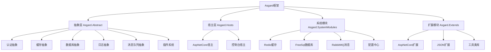

# Asgard Framework 🌳

[](https://dotnet.microsoft.com/)
[](https://docs.microsoft.com/en-us/dotnet/csharp/)
[](LICENSE)
[](https://github.com/your-org/asgard)

> **阿斯加德框架** - 基于北欧神话世界之树概念设计的现代.NET微服务框架

## 🎯 项目简介

Asgard（阿斯加德）是一个高度模块化的.NET微服务框架，灵感来源于北欧神话中的世界之树Yggdrasil。它提供了完整的微服务基础设施，包括认证、缓存、数据库、日志、消息队列等核心组件，支持插件化架构和动态扩展。

## ✨ 核心特性

- 🧩 **插件化架构** - 支持动态加载和卸载插件
- 🏗️ **模块化设计** - 认证、缓存、数据库、日志、消息队列独立模块
- ⚙️ **配置中心** - 统一的配置管理和动态更新
- 🔐 **JWT认证** - 完整的身份认证和授权体系
- 🗄️ **多数据库支持** - 基于FreeSql的ORM，支持多种数据库
- 📨 **消息队列** - 集成RabbitMQ，支持分布式消息处理
- 🔄 **缓存系统** - Redis缓存支持，提升系统性能
- 🆔 **分布式ID** - 雪花算法生成分布式唯一ID
- 📊 **任务调度** - 内置定时任务和后台作业支持
- 🚀 **ASP.NET Core集成** - 完美支持ASP.NET Core宿主

## 🏗️ 系统架构

### 架构层次



### 核心概念

- **Yggdrasil（世界之树）** - 框架核心容器，管理所有组件
- **Bifrost（彩虹桥）** - 插件系统的入口点
- **AsgardContext** - 上下文对象，提供运行时环境
- **NodeConfig** - 节点配置，定义系统行为

## 🚀 快速开始

### 1. 安装框架

```bash
# 创建新项目
dotnet new web -n MyAsgardApp
cd MyAsgardApp

# 添加核心包
dotnet add package Asgard.Abstract
dotnet add package Asgard.Hosts.AspNetCore
```

### 2. 基本配置

创建配置文件 `appsettings.json`:

```json
{
  "NodeConfig": {
    "Name": "MyAsgardApp",
    "DefaultDB": {
      "DbType": 3,
      "DbAddress": "Data Source=myapp.db"
    },
    "Redis": {
      "ConnectionString": "localhost:6379"
    },
    "AuthConfig": {
      "JwtKey": "your-secret-key",
      "Issuer": "MyApp",
      "Audience": "MyAppUsers"
    }
  }
}
```

### 3. 启动应用

```csharp
using Asgard.Abstract.Models.AsgardConfig;
using Asgard.Hosts.AspNetCore;

var builder = WebApplication.CreateBuilder(args);

// 配置Asgard
var nodeConfig = new NodeConfig
{
    Name = "MyAsgardApp",
    DefaultDB = new DefaultDBConfig
    {
        DbType = (int)FreeSql.DataType.Sqlite,
        DbAddress = "Data Source=myapp.db"
    },
    WebAPIConfig = new WebApiConfig
    {
        HttpPort = 5000,
        HttpsPort = 5001
    }
};

// 构建并启动
var yggdrasil = new YggdrasilBuilder(nodeConfig)
    .UseFreeSqlDBManager()
    .UseRedisCache()
    .UseAuthModule()
    .BuildAspNetCoreHost();

await yggdrasil.LoadPluginFromAllSource().StartAsync();
```

## 📋 详细文档

### 配置管理

Asgard使用统一的`NodeConfig`配置模型：

```csharp
public class NodeConfig
{
    public string Name { get; set; }                    // 节点名称
    public DefaultDBConfig DefaultDB { get; set; }      // 数据库配置
    public RedisConfig Redis { get; set; }              // Redis配置
    public AuthConfig AuthConfig { get; set; }          // 认证配置
    public WebApiConfig WebAPIConfig { get; set; }      // WebAPI配置
    public List<PluginItem> Plugins { get; set; }       // 插件配置
}
```

### 插件开发

#### 创建插件项目

1. 创建类库项目
2. 添加对`Asgard.Abstract`的引用
3. 根据宿主类型选择合适的基类

##### 基础插件（适用于所有宿主）

```csharp
using Asgard.Abstract;
using Asgard.Abstract.DataBase;
using Asgard.Abstract.Logger;
using Asgard.Abstract.Plugin;

namespace MyPlugin
{
    public class MyBifrost : AbsBifrost
    {
        public MyBifrost(AbsDataBaseManager dbInstance, AbsLoggerProvider loggerProvider)
            : base(dbInstance, loggerProvider)
        {
        }

        /// <summary>
        /// 系统启动完成后调用
        /// </summary>
        public override void OnSystemStarted(AsgardContext context)
        {
            LoggerProvider?.CreateLogger<MyBifrost>()
                .LogInformation("插件启动完成，事件ID: {EventID}", context.EventID);
            
            // 在这里执行插件初始化逻辑
        }

        /// <summary>
        /// 系统关闭时调用
        /// </summary>
        public override void SystemTryShutDown()
        {
            LoggerProvider?.CreateLogger<MyBifrost>()
                .LogInformation("插件正在关闭...");
            
            // 在这里执行清理工作
        }

        /// <summary>
        /// 插件排序（可选）
        /// </summary>
        public override int Order => 1; // 默认为0
    }
}
```

##### ASP.NET Core插件

```csharp
using Asgard.Abstract;
using Asgard.Abstract.DataBase;
using Asgard.Abstract.Logger;
using Asgard.Hosts.AspNetCore;
using Microsoft.AspNetCore.Builder;
using Microsoft.Extensions.DependencyInjection;

namespace MyAspNetPlugin
{
    public class MyAspBifrost : AbsAspNetCoreHostBifrost
    {
        public MyAspBifrost(AbsDataBaseManager dbInstance, AbsLoggerProvider loggerProvider)
            : base(dbInstance, loggerProvider)
        {
        }

        /// <summary>
        /// Web应用构建时调用
        /// </summary>
        public override void OnBuildWebApp(IApplicationBuilder builder)
        {
            // 配置ASP.NET Core中间件
            // builder.UseRouting();
            // builder.UseEndpoints(endpoints => { ... });
        }

        /// <summary>
        /// 服务初始化时调用
        /// </summary>
        public override void OnServiceInit(IServiceCollection service)
        {
            // 注册ASP.NET Core服务
            // service.AddControllers();
            // service.AddScoped<IMyService, MyService>();
        }

        /// <summary>
        /// 系统启动完成后调用
        /// </summary>
        public override void OnSystemStarted(AsgardContext context)
        {
            LoggerProvider?.CreateLogger<MyAspBifrost>()
                .LogInformation("ASP.NET Core插件启动完成");
        }

        /// <summary>
        /// 系统关闭时调用
        /// </summary>
        public override void SystemTryShutDown()
        {
            LoggerProvider?.CreateLogger<MyAspBifrost>()
                .LogInformation("ASP.NET Core插件正在关闭");
        }
    }
}
```

#### 插件项目结构

```
MyPlugin/
├── MyPlugin.csproj
├── MyBifrost.cs          # 插件入口类
├── Controllers/          # 控制器（ASP.NET Core插件）
│   └── MyController.cs
├── Services/             # 服务类
│   └── IMyService.cs
│   └── MyService.cs
└── Models/               # 数据模型
    └── MyModel.cs
```

#### 插件配置

在`appsettings.json`中配置插件：

```json
{
  "NodeConfig": {
    "Plugins": [
      {
        "Name": "MyPlugin",
        "FilePath": "MyPlugin.dll",
        "EntranceTypeDesc": "MyPlugin.MyBifrost"
      }
    ]
  }
}
```

#### 插件部署

1. **编译插件项目**：
   ```bash
   dotnet build MyPlugin.csproj
   ```

2. **复制到插件目录**：
   ```bash
   cp MyPlugin.dll ./plugins/MyPlugin/
   ```

3. **配置启用**：
   在配置文件中添加插件配置，或放入`plugins`目录自动加载

### 认证系统

Asgard提供基于JWT的认证系统，通过`AuthManager`实现：

#### 配置认证
```csharp
var nodeConfig = new NodeConfig
{
    AuthConfig = new AuthConfig
    {
        JwtKey = AuthKVToolsMethod.CreateNewHMACSHA256Key(), // Base64编码的密钥
        Issuer = "MyApp",
        Audience = "MyAppUsers",
        AesKey = AuthKVToolsMethod.CreateNewAesKeyAndVi().key,
        AesIV = AuthKVToolsMethod.CreateNewAesKeyAndVi().iv
    }
};
```

#### 创建Token
```csharp
// 获取认证管理器
var authManager = context.Auth;

// 创建用户信息
var userInfo = new UserInfo
{
    UID = 12345,
    UserName = "admin",
    // 其他用户信息...
};

// 创建访问Token
if (authManager.TryCreateToken(userInfo, out string token, null, DateTime.Now.AddHours(2)))
{
    // token创建成功
}

// 创建刷新Token
if (authManager.TryCreateRefreshToken(userInfo, out string refreshToken, out string jti))
{
    // 刷新token创建成功
}
```

#### 验证Token
```csharp
// 验证并解析Token
if (authManager.TryGetUserInfo(rawToken, out UserInfo userInfo, out string jti, out TokenType type))
{
    // 验证成功，userInfo包含用户信息
    Console.WriteLine($"用户ID: {userInfo.UID}");
}
```

#### 控制器中使用认证
```csharp
[ApiController]
[Route("api/[controller]")]
public class UserController : APIControllerBase
{
    public UserController(AsgardContext context, AbsLoggerProvider logger)
        : base(context, logger) { }

    // 需要认证
    [HttpGet("profile")]
    [Auth()]  // 使用Asgard的认证特性
    public DataResponse<UserProfile> GetProfile()
    {
        // 从Context中获取当前用户信息
        var userInfo = Context.Auth?.GetCurrentUser();
        return HandleData(new UserProfile { UserName = userInfo?.UserName });
    }

    // 需要特定角色
    [HttpGet("admin")]
    [Auth(roles: new[] { "admin" })]
    public DataResponse<string> AdminOnly()
    {
        return HandleData("管理员访问");
    }

    // 需要商户ID
    [HttpGet("tenant")]
    [Auth(needsTenantID: true)]
    public DataResponse<string> TenantData()
    {
        return HandleData("商户数据");
    }
}
```

### 缓存系统

支持Redis和内存缓存：

```csharp
// 使用Redis缓存
builder.UseRedisCache();

// 使用内存缓存
builder.UseMemCache();
```

### 数据库操作

基于FreeSql的ORM支持：

```csharp
// 定义实体
public class User
{
    public long Id { get; set; }
    public string Name { get; set; }
    public string Email { get; set; }
}

// 使用仓储模式
var userRepo = context.DB.GetRepository<User>();
var user = await userRepo.Where(u => u.Id == 1).FirstAsync();
```

### 消息队列

集成RabbitMQ支持：

```csharp
// 发送消息
await context.MQ.PublishAsync("exchange.name", new { Message = "Hello World" });

// 接收消息
await context.MQ.SubscribeAsync("queue.name", async (message) =>
{
    // 处理消息
    Console.WriteLine($"Received: {message}");
});
```

## 📁 项目结构

```
Asgard/
├── Asgard.Abstract/              # 核心抽象层
│   ├── Auth/                     # 认证抽象
│   ├── Cache/                    # 缓存抽象
│   ├── DataBase/                 # 数据库抽象
│   ├── Logger/                   # 日志抽象
│   ├── MQ/                       # 消息队列抽象
│   ├── Models/                   # 数据模型
│   └── Plugin/                   # 插件系统
├── Asgard.Hosts/                 # 宿主实现
│   └── Asgard.Hosts.AspNetCore/  # ASP.NET Core宿主
├── Asgard.SystemModules/         # 系统模块
│   ├── Asgard.Caches.Redis/      # Redis缓存实现
│   ├── Asgard.DataBaseManager.FreeSql/  # FreeSql数据库
│   ├── Asgard.MQ.RabbitMQ/       # RabbitMQ消息队列
│   └── Asgard.Logger.FreeSqlProvider/  # FreeSql日志
├── Asgard.Extends/               # 扩展模块
│   ├── Asgard.Extends.AspNetCore/  # ASP.NET Core扩展
│   ├── Asgard.Extends.Json/      # JSON扩展
│   └── Asgard.Tools/             # 工具类库
└── Asgard.Examples/              # 示例项目
    └── Asgard.AspNetCore.Full/   # 完整示例
```

## 🛠️ 开发指南

### 环境要求

- .NET 6.0 或更高版本
- Visual Studio 2022 或 VS Code
- Redis (可选)
- RabbitMQ (可选)
- SQLite/MySQL/PostgreSQL (根据需求)

### 开发规范

1. **命名规范**
   - 抽象类使用`Abs`前缀
   - 接口使用`I`前缀
   - 插件类使用`Bifrost`后缀

2. **代码风格**
   - 使用C# 10.0语法
   - 遵循SOLID原则
   - 提供完整的XML注释

3. **插件开发**
   - 每个插件独立项目
   - 使用特性标记插件类型
   - 提供完整的配置选项

### 贡献指南

1. Fork项目
2. 创建功能分支 (`git checkout -b feature/AmazingFeature`)
3. 提交更改 (`git commit -m 'Add some AmazingFeature'`)
4. 推送到分支 (`git push origin feature/AmazingFeature`)
5. 创建Pull Request

## 📚 示例项目

### 基础Web API

查看 `Asgard/Examples/Asgard.AspNetCore.Full` 获取完整示例：

```bash
cd Asgard/Examples/Asgard.AspNetCore.Full
dotnet run
```

### 插件示例

基于 `Asgard.AspNetCore.Full` 示例项目的正确插件实现：

```csharp
using System.Reflection;
using Asgard.Abstract;
using Asgard.Abstract.DataBase;
using Asgard.Abstract.Logger;
using Asgard.Hosts.AspNetCore;
using Microsoft.AspNetCore.Builder;
using Microsoft.Extensions.DependencyInjection;

namespace MyAsgardApp
{
    /// <summary>
    /// 插件入口类 - 继承自 AbsAspNetCoreHostBifrost
    /// </summary>
    public class Bifrost : AbsAspNetCoreHostBifrost
    {
        public Bifrost(AbsDataBaseManager dbInstance, AbsLoggerProvider loggerProvider)
            : base(dbInstance, loggerProvider)
        {
        }

        /// <summary>
        /// Web应用构建完成后调用
        /// </summary>
        public override void OnBuildWebApp(IApplicationBuilder builder)
        {
            // 可以在这里添加中间件配置
            // builder.UseMiddleware<MyMiddleware>();
        }

        /// <summary>
        /// 服务初始化时调用
        /// </summary>
        public override void OnServiceInit(IServiceCollection service)
        {
            // 注册自定义服务
            // service.AddScoped<IMyService, MyService>();
        }

        /// <summary>
        /// 系统启动完成后调用
        /// </summary>
        public override void OnSystemStarted(AsgardContext context)
        {
            // 系统启动后的初始化工作
            var logger = LoggerProvider.CreateLogger<Bifrost>();
            logger.LogInformation("系统启动完成，事件ID: {EventID}", context.EventID);
        }

        /// <summary>
        /// 系统关闭时调用
        /// </summary>
        public override void SystemTryShutDown()
        {
            // 清理资源
            LoggerProvider.CreateLogger<Bifrost>().LogInformation("系统正在关闭...");
        }
    }
}
```

### 控制器示例

基于示例项目的控制器实现：

```csharp
using Asgard.Abstract;
using Asgard.Abstract.Logger;
using Asgard.Extends.AspNetCore;
using Asgard.Extends.AspNetCore.ApiModels;
using Asgard.Extends.AspNetCore.Auth;
using Microsoft.AspNetCore.Mvc;

namespace MyAsgardApp.Controllers
{
    /// <summary>
    /// HelloWorld控制器示例
    /// </summary>
    [ApiController]
    [Route("Asgard/[Controller]")]
    [ApiExplorerSettings(GroupName = "MyAsgardApp")]
    public class HelloWorldController : APIControllerBase
    {
        public HelloWorldController(AsgardContext context, AbsLoggerProvider logger)
            : base(context, logger)
        {
        }

        /// <summary>
        /// 获取欢迎消息
        /// </summary>
        [HttpGet("")]
        [Auth()]  // 需要认证
        public virtual DataResponse<string> GetWelcomeMessage()
        {
            return HandleData("欢迎来到Asgard框架！");
        }

        /// <summary>
        /// 获取系统信息
        /// </summary>
        [HttpGet("system-info")]
        public virtual DataResponse<object> GetSystemInfo()
        {
            return HandleData(new
            {
                EventID = Context.EventID,
                NodeName = Context.NodeConfig.Name,
                Timestamp = DateTime.Now
            });
        }
    }
}
```

## 🔧 故障排除

### 常见问题

1. **插件加载失败**
   - 检查插件DLL路径是否正确
   - 确认插件类继承自`AbsBifrost`
   - 验证特性标记是否正确

2. **数据库连接失败**
   - 检查连接字符串格式
   - 确认数据库服务已启动
   - 验证数据库权限

3. **Redis连接失败**
   - 检查Redis服务状态
   - 确认连接字符串格式
   - 验证防火墙设置

### 调试技巧

```csharp
// 启用详细日志
var nodeConfig = new NodeConfig
{
    SystemLog = new LogConfig
    {
        EnableConsole = true,
        LogLevel = LogLevelEnum.Debug
    }
};
```

## 📄 许可证

本项目采用MIT许可证 - 查看 [LICENSE](LICENSE) 文件了解详情。

## 🤝 支持

- 📧 邮箱: support@asgard-framework.com
- 💬 讨论: [GitHub Discussions](https://github.com/your-org/asgard/discussions)
- 🐛 问题: [GitHub Issues](https://github.com/your-org/asgard/issues)

## 🙏 致谢

- 感谢所有贡献者的努力
- 特别感谢.NET社区的支持
- 灵感来源于北欧神话的世界之树

---

<div align="center">
  <p>
    <sub>Built with ❤️ by the Asgard team</sub>
  </p>
  <p>
    <a href="https://github.com/your-org/asgard">⭐ Star us on GitHub</a>
  </p>
</div>